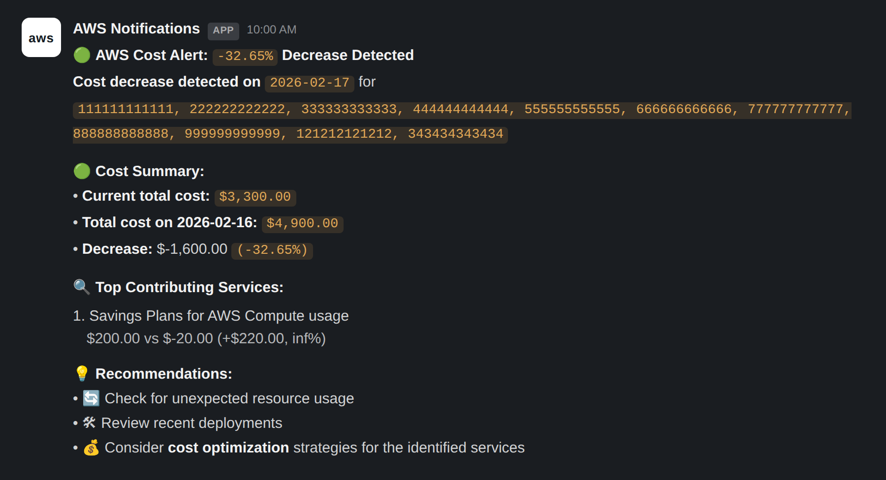
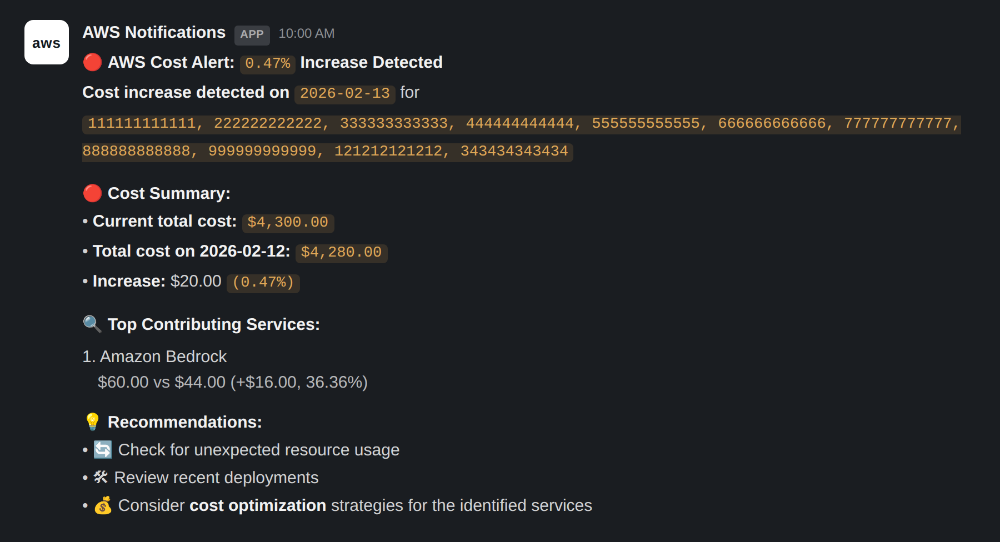

# AWS Cost Anomaly → Slack Alert

A small, dependency-light Lambda that checks your AWS Cost Explorer spend
once a day, compares it to the day before, and posts a Slack alert when
total spend — or any single service — jumps beyond a threshold you control.

```
🔴 AWS Cost Alert: 18.42% Increase Detected
Cost increase detected on 2026-08-30

🔴 Cost Summary:
• Current total cost: $412.90
• Total cost on 2026-08-29: $348.60
• Increase: $64.30 (18.42%)

🔍 Top Contributing Services:
1. Amazon Elastic Compute Cloud - Compute
   $210.40 vs $150.10 (+$60.30, 40.17%)
2. Amazon Simple Storage Service
   $12.10 vs $8.00 (+$4.10, 51.25%)

💡 Recommendations:
• Check for unexpected resource usage
• Review recent deployments
• Consider cost optimization strategies for the services above
```

## How it works

1. An EventBridge schedule (default: once a day) invokes the Lambda.
2. The Lambda calls `ce:GetCostAndUsage` for the last 7 days, grouped by
   service.
3. It compares the two most recent days. A service is flagged if it grew
   by more than `MIN_PCT_INCREASE`% **and** at least `MIN_ABS_INCREASE_USD`
   dollars (both thresholds must be crossed, so a jump from $0.01 to $0.02
   won't page you).
4. If anything is flagged, it posts a formatted summary to a Slack
   incoming webhook.

Cost Explorer is a global AWS service, so this works no matter which
region you deploy the Lambda into.

## Example alerts





These are recreations of real alerts from a production deployment, with
every dollar figure and account ID replaced by placeholder values before
publishing.

One detail to flag: the `for <account IDs>` line groups spend by linked
account, which is useful in an AWS Organization with multiple accounts
under one payer. The base `lambda_function.py` in this repo reports at the
payer-account level and doesn't include that line — to reproduce it, add
`{"Type": "DIMENSION", "Key": "LINKED_ACCOUNT"}` alongside `SERVICE` in the
`GroupBy` list in `get_service_costs()`, and extend the role's Cost
Explorer statement with `ce:GetDimensionValues` if you also want to
resolve account IDs to account names.

## Project layout

```
.
├── src/
│   └── lambda_function.py   # the Lambda handler
├── template.yaml             # CloudFormation (AWS SAM) — function, role, schedule
├── requirements.txt           # runtime dependency (requests)
├── LICENSE
└── .gitignore
```

`boto3` isn't in `requirements.txt` because every Lambda Python runtime
ships it already; you only need it locally if you want to test outside
Lambda (`pip install boto3`).

## Prerequisites

- An AWS account, with the AWS CLI installed and configured
  (`aws configure`) using credentials that can create Lambda functions,
  IAM roles, EventBridge rules, and CloudFormation stacks. (These are
  account-admin-level actions to *deploy* the stack — separate from the
  narrow, read-only role the Lambda itself runs with once deployed.)
- [AWS SAM CLI](https://docs.aws.amazon.com/serverless-application-model/latest/developerguide/install-sam-cli.html) installed.
- [Docker](https://docs.docker.com/get-docker/) installed and running, if
  you build with `--use-container` (recommended — see below).
- **Cost Explorer enabled** on the account you're monitoring: it's off by
  default on new accounts. Turn it on once at
  [Billing and Cost Management → Cost Explorer](https://console.aws.amazon.com/costmanagement/home#/cost-explorer)
  in the console, then wait — AWS says up to 24 hours for the first data
  to appear. If you deploy before that finishes, `get_cost_and_usage` will
  return an empty or partial result rather than an error, so an early
  "no data" run isn't a sign something's broken.
  - In an AWS Organization, Cost Explorer for a **member account** only
    shows that account's own costs unless the payer account has shared
    consolidated billing data with it; enabling Cost Explorer is generally
    done from the management (payer) account.
- A Slack workspace where you can create an
  [incoming webhook](https://api.slack.com/messaging/webhooks) — you'll
  need "manage webhooks" permission in that workspace, or ask a workspace
  admin to create one and give you the URL.

## Deploy

```bash
# 1. Create the Slack incoming webhook (see Prerequisites) and copy its URL.
#    Sanity-check it works before you deploy anything:
curl -X POST -H 'Content-Type: application/json' \
  -d '{"text":"test from aws-cost-anomaly-alert"}' \
  https://hooks.slack.com/services/YOUR/WEBHOOK/URL

# 2. Build. --use-container compiles dependencies inside a Lambda-like
#    Docker image, so they match Lambda's Linux/arm64 runtime even if
#    you're building on macOS or Windows — skip it only if you're
#    building on Linux/x86_64 or arm64 already.
sam build --use-container

# 3. Deploy, answering the prompts.
sam deploy --guided
```

`sam deploy --guided` will ask for:

- **Stack Name** — anything, e.g. `aws-cost-anomaly-alert`.
- **AWS Region** — any region; Cost Explorer works the same regardless.
- **Parameter SlackWebhookUrl** — paste the webhook URL from step 1 (kept
  out of CloudFormation console/CLI output via `NoEcho`).
- **Parameter ScheduleExpression / MinPctIncrease / MinAbsIncreaseUsd /
  LookbackDays** — press enter to accept the defaults, or override them.
- **Confirm changes before deploy** — `Y` is fine for a first deploy.
- **Allow SAM CLI IAM role creation** — answer **`Y`**; the template
  creates the Lambda's execution role and this permission is required for
  that to succeed.
- **Save arguments to configuration file** — `Y` if you want `sam deploy`
  (no flags) to work next time. This writes `samconfig.toml`, which is
  git-ignored since it can end up holding the webhook URL if you ever
  pass one on the command line instead of at the interactive prompt.

Deployment takes roughly a minute. When it finishes, the `Outputs` section
printed to your terminal includes the deployed function name and role
ARN.

### Parameters

| Parameter | Default | Description |
|---|---|---|
| `SlackWebhookUrl` | *(required)* | Slack incoming webhook URL |
| `ScheduleExpression` | `rate(1 day)` | Any [EventBridge schedule expression](https://docs.aws.amazon.com/eventbridge/latest/userguide/eb-rate-expressions.html) (e.g. `rate(6 hours)`, `cron(0 8 * * ? *)`) |
| `MinPctIncrease` | `10` | Minimum % increase to flag a service |
| `MinAbsIncreaseUsd` | `10` | Minimum $ increase to flag a service |
| `LookbackDays` | `7` | Days of cost history pulled per run |

## Verifying it worked

```bash
# Tail logs from the most recent invocation (replace with your stack name)
sam logs --stack-name aws-cost-anomaly-alert --tail

# Or invoke it manually right now instead of waiting for the schedule
aws lambda invoke --function-name <FunctionName from Outputs> /dev/stdout
```

A run with nothing to report logs `No service crossed the alert threshold
on <date>` and posts nothing to Slack — that's the normal, quiet case, not
a failure.

## What this costs to run

Two small, ongoing AWS charges, on top of whatever it might one day catch:

- **Cost Explorer API calls** are billed per request (a small fraction of
  a cent each, priced per the [AWS Billing and Cost Management pricing page](https://aws.amazon.com/aws-cost-management/pricing/)) —
  at one run a day this is well under $1/month.
- **Lambda + CloudWatch Logs**: at 128 MB memory and a few seconds per
  run, once a day, this stays inside the AWS Free Tier for the life of the
  account.

## IAM role & policy

`template.yaml` creates the execution role for you, scoped to exactly what
this function calls — no console-generated wildcard Cost Explorer policy:

- **Cost Explorer**: `ce:GetCostAndUsage` only, with `Resource: "*"` (Cost
  Explorer doesn't support resource-level permissions on any of its
  actions, so `*` is required here — but the *action* list is trimmed to
  the one API this code actually uses, rather than the ~30 `ce:Get*`/`ce:List*`
  actions the IAM console's "Cost Explorer Service" managed policy
  suggests, most of which cover features — Savings Plans recommendations,
  anomaly subscriptions, forecasts, rightsizing — this function doesn't
  touch).
- **CloudWatch Logs**: `logs:CreateLogGroup`/`CreateLogStream`/`PutLogEvents`,
  scoped to this function's own log group.

The role's name is auto-generated by CloudFormation rather than hardcoded,
so deploying only needs the `CAPABILITY_IAM` capability (what the guided
deploy's "Allow SAM CLI IAM role creation" prompt grants) — not the
broader `CAPABILITY_NAMED_IAM`.

If you extend the Lambda to use other Cost Explorer features later, add
the specific `ce:` actions it needs to the `CostExplorerReadOnly` policy
statement in `template.yaml`.

## Local testing

```bash
pip install -r requirements.txt boto3
export SLACK_WEBHOOK_URL="https://hooks.slack.com/services/..."
export AWS_PROFILE=your-profile   # needs ce:GetCostAndUsage
python -c "from src.lambda_function import lambda_handler; lambda_handler(None, None)"
```

## Customizing

- **Excluded services / cost types**: edit `EXCLUDED_SERVICES` in
  `lambda_function.py` (defaults to excluding Savings Plans and Tax lines,
  which tend to be noisy for anomaly detection).
- **Alert format**: edit `build_slack_message()`.
- **Metric**: this uses `UnblendedCost`; swap to `AmortizedCost` in
  `get_service_costs()` if you want Reserved Instance/Savings Plan costs
  amortized across their term.

## Troubleshooting

| Symptom | Likely cause |
|---|---|
| `AccessDeniedException` calling `ce:GetCostAndUsage` | Cost Explorer isn't enabled yet on this account (see Prerequisites), or — in an AWS Organization member account — it hasn't been enabled/shared from the payer account. |
| Empty `service_costs` / "Not enough data for a day-over-day comparison" | Cost Explorer was enabled less than ~24-48h ago and hasn't backfilled data yet. |
| `sam build` fails or the deployed function errors on cold start with a native-extension import error | You built without `--use-container` on a non-Linux machine; a dependency (e.g. `charset_normalizer`, a `requests` transitive dependency) compiled a binary extension for your OS instead of Lambda's. Rebuild with `sam build --use-container`. |
| CloudFormation error mentioning `CAPABILITY_NAMED_IAM` | Shouldn't happen with this template as shipped (the IAM role has no hardcoded name) — but if you added a `RoleName` while customizing, either remove it or add `--capabilities CAPABILITY_NAMED_IAM` to your deploy command. |
| Slack alert never arrives even though logs show "Slack alert sent" | Double check the webhook URL is for the right channel/workspace, and that the webhook hasn't been revoked in Slack's app management page. |

## Uninstall

```bash
sam delete
```

## License

MIT — see [LICENSE](LICENSE).
